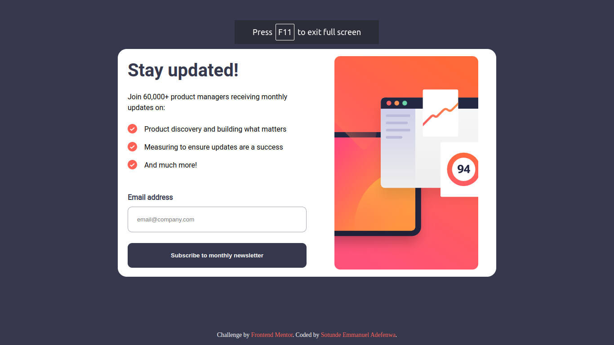

# Frontend Mentor - Newsletter sign-up form with success message solution

This is a solution to the [Newsletter sign-up form with success message challenge on Frontend Mentor](https://www.frontendmentor.io/challenges/newsletter-signup-form-with-success-message-3FC1AZbNrv). Frontend Mentor challenges help you improve your coding skills by building realistic projects. 

## Table of contents

- [Overview](#overview)
  - [The challenge](#the-challenge)
  - [Screenshot](#screenshot)
  - [Links](#links)
- [My process](#my-process)
  - [Built with](#built-with)
  - [What I learned](#what-i-learned)
  - [Continued development](#continued-development)
  - [Useful resources](#useful-resources)
- [Author](#author)
- [Acknowledgments](#acknowledgments)


## Overview

### The challenge

Users should be able to:

- Add their email and submit the form
- See a success message with their email after successfully submitting the form
- See form validation messages if:
  - The field is left empty
  - The email address is not formatted correctly
- View the optimal layout for the interface depending on their device's screen size
- See hover and focus states for all interactive elements on the page

### Screenshot




### Links

- Solution URL: [Add solution URL here](https://your-solution-url.com)
- Live Site URL: [Add live site URL here](https://your-live-site-url.com)

## My process

### Built with

- Semantic HTML5 markup
- CSS custom properties
- Flexbox
- Javascript 
- Mobile-first workflow


### What I learned
- In this project, I did a little retrospect on my DOM manipulation knowledge.

- I also learned how to use clamp effectively for font-size
```html
<h1>Stay Updated</h1>
```
```css
h1 {
  font-size: clamp(30px, 2.5em, 5em);
}
```

- Also, I learned the use of gap, a new feature associated to flexbox

```html
<div class="list-text">
  <div class="list one">
     
     <p>Product discovery and building what matters</p>
   </div>
  <div class="list two">
     
     <p>Measuring to ensure updates are a success</p>
    </div>
  <div class="list three">
     
     <p>And much more!</p>
      </div>

```css
.list {
  display: flex;
  gap: 1em;
}
```
- I also learned how to use Regular Expressions for form validation
```html
 <div class="email-area">
              <div class="email-confirmation">
                <p class="email">Email address</p>
                <p class="valid-email hidden">Valid Email Required</p>
              </div>
              <input
                type="email"
                name="email-field"
                placeholder="email@company.com "
                class="email-field"
              />
            </div>
            <button class="btn submit" type="submit">
              Subscribe to monthly newsletter
            </button>

```css
/* STYLING FOR EMAIL FIELD */

.email-area {
  display: flex;
  flex-direction: column;
  padding-bottom: 1.5em;
}

.email {
  color: hsl(235, 18%, 26%);
  font-weight: 700;
  padding: 0.5em 0;
}

.email-confirmation {
  display: flex;
  align-items: center;
  justify-content: space-between;
}
.valid-email {
  color: hsl(4, 100%, 67%);
  font-weight: 700;
}

.email-field {
  max-width: 100%;
  padding: 1.5em;
  border-radius: 10px;
  border: 1px solid hsl(231, 7%, 68%);
}

input:active,
input:hover {
  border: 2px solid #000;
}

.btn {
  padding: 1.5em;
  margin-bottom: 1.5em;
  width: 100%;
  border-radius: 10px;
  font-weight: bold;
  color: #fff;
  border: none;
  background-color: hsl(235, 18%, 26%);
}

.btn:hover,
.btn:focus {
  background-color: hsl(4, 100%, 67%);
  box-shadow: 15px 15px 15px hsla(4, 100%, 67%, 0.4);
}
```
```js
subscribeBtnEL.addEventListener("click", function () {
  const email = emailFieldEL.value; // storing the value of the email field in a variable
  const emailRegex = /^[A-Za-z0-9._%+-]+@[A-Za-z0-9.-]+\.[A-Za-z]{2,4}/; // Regular expression for email
  if (!email) {
    // If no value is inputed
    validEmailEL.classList.remove("hidden");
    emailFieldEL.classList.add("form-color");
  } else {
    // If a value is inputed
    if (emailRegex.test(email)) {
      // if the value inputed is an email
      correctEmail();
      targetEmail.textContent = email;
    } else {
      incorrectEmail();
    }
  }
});
```


### Continued development
- I need to sharpen my knowledge on centralising an object in css
- Also, DOM Manipulation
- How to use clamp effectively
- Deep knowledge on Regular expressions


## Author

- Frontend Mentor - [@Manuelcoder02](https://www.frontendmentor.io/profile/Manuelcoder02)
- Twitter - [juniorDev @sotundenuel](https://www.twitter.com/@sotundenuel)
- Instagram - [
- Thread -
- Whatsapp -
- Facebook - 

## Acknowledgments

Shoutout to my personal AI chatbox on whatsapp PI for your useful guidance and also ChatGPT

